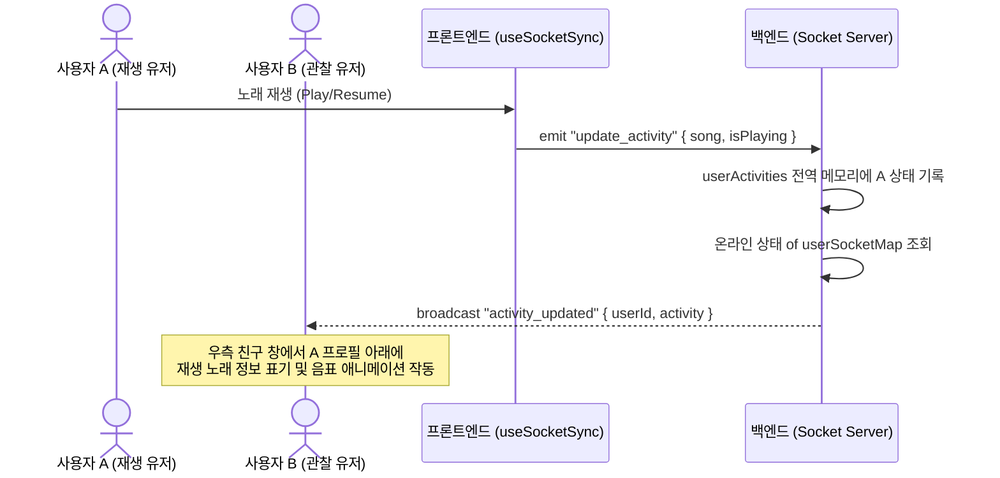
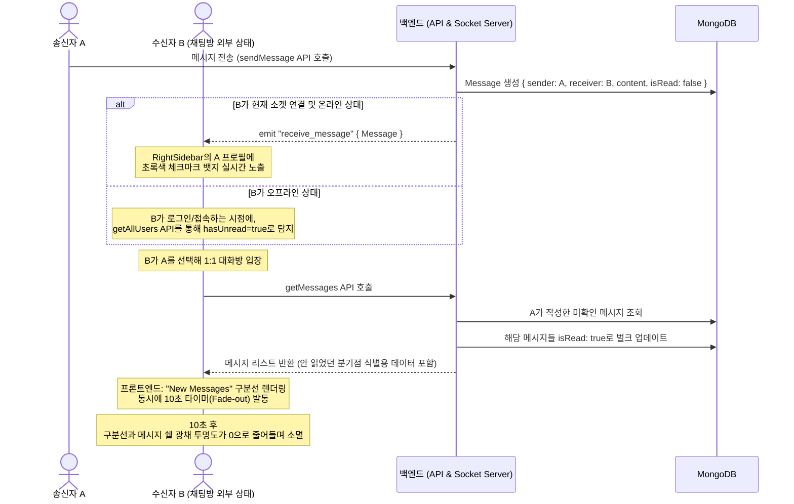
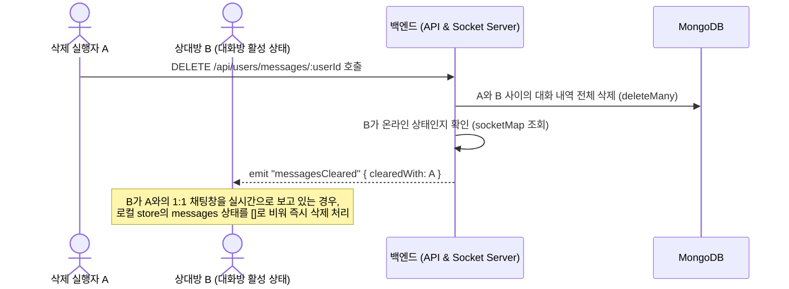

# 🎵 Spotify Music Catalog & Real-Time Collaboration Web & Mobile (Spotify 클론코딩)

본 프로젝트는 **Spotify 클론 코딩 풀스택 웹 및 모바일 애플리케이션**입니다.  
사용자는 인증(Clerk)을 통해 로그인하여 고품질의 음악 스트리밍 및 앨범 감상을 즐길 수 있으며, 관리자(Admin) 계정으로 접근 시 신규 음원 및 음반 컬렉션을 즉각 업로드/삭제할 수 있는 대시보드가 활성화됩니다.

특히, `Socket.io`를 긴밀하게 연동하여 **실시간 친구 활동 모니터링(듣고 있는 노래 실시간 공유)**, **최근 대화 유저 최상단 동적 정렬**, 그리고 **1:1 실시간 채팅(읽지 않은 메시지 구분선 및 양방향 동시성 삭제 보장)** 기능을 완벽히 개발하여 서비스의 완성도를 극대화했습니다.

---

## 📌 목차
1. [프로젝트 소개 및 특징](#1-프로젝트-소개-및-특징)
2. [주요 기술 스택 (Tech Stack)](#2-주요-기술-스택-tech-stack)
3. [전체 프로젝트 폴더 구조 및 파일 역할](#3-전체-프로젝트-폴더-구조-및-파일-역할)
4. [로컬 개발 환경 설정 가이드](#4-로컬-개발-환경-설정-가이드)
5. [모바일 앱 (Expo) 빌드 및 테스트 가이드](#5-모바일-앱-expo-빌드-및-테스트-가이드)
6. [어드민 대시보드 사용 가이드](#6-어드민-대시보드-사용-가이드)
7. [구현 완료된 실시간 기능 및 채팅 시스템 (Socket.io & MongoDB)](#7-구현-완료된-실시간-기능-및-채팅-시스템-socketio--mongodb)
8. [💡 기술적 도전 및 리팩토링 사례](#8-기술적-도전-및-리팩토링-사례)
9. [프로덕션 빌드 및 배포(Deployment) 절차](#9-프로덕션-빌드-및-배포deployment-절차)

---

## 1. 프로젝트 소개 및 특징
* **풀스택 구조**: 백엔드는 Node.js & Express & MongoDB, 프론트엔드는 React 19 & Vite 8 & Zustand 5 기반으로 구축된 결합형 서비스입니다.
* **모바일 프론트엔드 연동**: Expo(React Native) 및 NativeWind를 기반으로 제작된 모바일 앱을 내장하고 있어, 동일한 실시간 데이터 및 백엔드를 웹과 모바일 앱에서 동시에 연계하여 사용 가능합니다.
* **실시간 연결성**: 모든 접속 유저는 실시간 웹소켓 세션을 맺어, 음악 재생 행위나 메시지 송수신이 즉시 브로드캐스트/1:1 딜리버리됩니다.
* **안정적인 아키텍처**: 세션 소멸 방지 설계, 인증 미들웨어 격상, Zustand의 최신 메모리 주소 다이렉트 제어를 통해 리렌더링 버그 및 실시간 누수를 해결했습니다.

---

## 2. 주요 기술 스택 (Tech Stack)

### 💻 웹 프론트엔드 (Web Frontend)
| 라이브러리 / 도구 | 버전 | 도입 이유 및 역할 |
| :--- | :--- | :--- |
| **React** | `^19.2.6` | 컴포넌트 구조의 고성능 UI 구축 및 모던 훅 API 활용 |
| **Vite** | `^8.0.12` | 번개처럼 빠른 로컬 빌드 환경 및 HMR 제공 |
| **Zustand** | `^5.0.14` | 중앙 스토어를 기반으로 보일러플레이트 없는 상태 공유 |
| **Socket.io-client** | `^4.8.3` | 백엔드 웹소켓 서버와의 양방향 실시간 이벤트 핸들링 |
| **@clerk/react** | `^6.10.3` | 고도화된 타사 인증 모듈로 안전한 회원가입/로그인 흐름 처리 |
| **Axios** | `^1.18.0` | JWT 베어러 토큰 자동 주입 및 API 비동기 통신 |
| **Tailwind CSS** | `^4.3.1` | 유틸리티 클래스를 사용한 신속한 스포티파이 테마 스타일링 |
| **Lucide React** | `^1.21.0` | 스포티파이 고유 감성을 재현하기 위한 고급 벡터 아이콘 팩 |

### 📱 모바일 프론트엔드 (Mobile Frontend)
| 라이브러리 / 도구 | 버전 | 도입 이유 및 역할 |
| :--- | :--- | :--- |
| **Expo (React Native)** | `~54.0.34` | 크로스플랫폼 모바일 앱 구동을 위한 최적화된 프레임워크 |
| **Expo Router** | `~6.0.23` | 파일 시스템 기반의 직관적인 앱 라우팅 및 탭바 네비게이션 제공 |
| **NativeWind** | `^4.2.6` | 모바일 디바이스 뷰포트에 맞춘 빠른 Tailwind CSS 스타일링 |
| **Zustand** | `^5.0.14` | 중앙 플레이어 상태 및 실시간 동기화를 위한 글로벌 스토어 |
| **AsyncStorage** | `^3.1.1` | 모바일 환경 전용 상태값의 로컬 기기 영구 보존 |
| **Expo SecureStore** | `^56.0.4` | Clerk 세션의 액세스 토큰을 안전한 키체인 영역에 캐싱 |
| **Expo AV** | `^16.0.8` | 오디오 백그라운드 스트리밍 및 재생 제어, 소리 조절 시스템 구축 |
| **Expo Image Picker** | `~3.0.11` | 기기 사진첩에서 이미지 선택 후 Multipart/FormData 업로드 |
| **Expo Document Picker** | `~12.0.2` | 기기 파일 저장소에서 오디오 음원 선택 후 서버 전송 |

### ⚙️ 백엔드 (Backend)
| 라이브러리 / 도구 | 버전 | 도입 이유 및 역할 |
| :--- | :--- | :--- |
| **Express.js** | `^5.2.1` | 모듈식 라우터 설계를 지원하는 간결한 REST API 프레임워크 |
| **Socket.io** | `^4.8.3` | 클라이언트 접속 관리, 활동 브로드캐스팅, 1:1 메시지 실시간 중계 |
| **MongoDB / Mongoose**| `^9.7.1` | 문서 지향 NoSQL 및 스키마 유효성 검증 모델링 |
| **@clerk/express** | `^2.1.29` | Express 미들웨어 레벨에서 Clerk 인증 토큰 검증 |
| **Cloudinary** | `^2.10.0` | 앨범 이미지 및 오디오 미디어 파일의 클라우드 영구 저장소 |
| **Express-fileupload** | `^1.5.2` | 어드민 음원 및 앨범아트 파일 업로드용 멀티파트 파서 |

---

## 3. 전체 프로젝트 폴더 구조 및 파일 역할

```text
webMobile-spotify/ (Project Root)
 ├─ mobile/                  # 모바일 프론트엔드 (Expo)
 │   ├─ app/                 # Expo Router 기반의 파일 라우트
 │   │   ├─ (tabs)/          # 하단 탭바 구조 (홈 및 채팅 목록)
 │   │   ├─ album/           # 앨범 수록곡 리스트 및 미니 플레이어 노출
 │   │   ├─ chat/            # 1:1 대화방 (페이드아웃 구분선 및 메시지 삭제 연계)
 │   │   ├─ admin/           # 모바일 어드민 대시보드 및 미디어 추가/삭제 폼
 │   │   └─ auth/            # Clerk Google OAuth 연동 로그인 모달
 │   ├─ components/          # 공통 UI 컴포넌트 (MiniPlayer 등)
 │   ├─ store/               # Zustand 스토어 (usePlayerStore, useChatStore 등)
 │   ├─ lib/                 # 호스트 IP 동적 탐색 axios 및 tokenCache 모듈
 │   ├─ .env                 # 모바일 앱 환경 변수
 │   └─ package.json         # 모바일 의존성 정의
 │
 ├─ backend/                 # 백엔드 API (Node.js)
 │   ├─ src/
 │   │   ├─ controllers/     # API 엔드포인트 비즈니스 로직
 │   │   │   ├─ admin.controller.js  # 곡/앨범 생성 및 삭제 제어
 │   │   │   ├─ album.controller.js  # 전체 및 특정 앨범 데이터 조회
 │   │   │   ├─ auth.controller.js   # 로그인 사용자 정보 유무에 따른 Callback 동기화
 │   │   │   ├─ song.controller.js   # 장르별/인기/추천 곡 조회
 │   │   │   ├─ stat.controller.js   # 어드민 통계 카드 연산 로직
 │   │   │   └─ user.controller.js   # 유저 목록, 대화내역 조회, 메시지 발송, 메시지 삭제
 │   │   ├─ lib/             # 공통 서비스 모듈 및 서드파티 커넥션
 │   │   │   ├─ cloudinary.js  # Cloudinary SDK 초기 설정
 │   │   │   ├─ connectDB.js   # MongoDB Atlas Mongoose 연결 설정
 │   │   │   └─ socket.js      # Socket.io 서버 구성 및 userSocketMap 관리
 │   │   ├─ middleware/      # 요청 필터링용 미들웨어
 │   │   │   └─ auth.middleware.js # 유저 토큰 인증 및 MongoDB 가입 강제 동기화 통합
 │   │   ├─ models/          # MongoDB Mongoose 데이터 모델 스키마
 │   │   │   ├─ album.model.js   # 앨범명, 아티스트, 커버아트, 수록곡 배열 관계
 │   │   │   ├─ message.model.js # 메시지 송수신자 ID, 내용 및 isRead 필드
 │   │   │   ├─ song.model.js    # 노래 정보, 재생시간, 음원 URL, 앨범 참조 ID
 │   │   │   └─ user.model.js    # 가입 유저의 이름, 이메일, 이미지 주소, Clerk ID
 │   │   ├─ routes/          # Express 라우팅 엔드포인트 바인딩
 │   │   └─ server.js        # 백엔드 서버 통합 실행 파일 (Express + HTTP Server + Socket)
 │   ├─ .env                 # 백엔드 환경 변수
 │   └─ package.json         # 백엔드 라이브러리 및 시작 스크립트 정의
 │
 └─ frontend/                # 웹 프론트엔드 (React)
     ├─ src/
     │   ├─ app/             # 최상위 라우터 설정 및 로더
     │   ├─ components/      # 전역 공통 UI 요소 (Topbar, Playback Control 등)
     │   ├─ hooks/           # 커스텀 훅 보관소
     │   │   └─ useSocketSync.ts # 소켓 연결 수립 및 재생 활동 전역 연동 훅
     │   ├─ layout/          # 메인 레이아웃 및 영역별 분리 구조
     │   │   ├─ MainLayout.tsx   # 좌측바-메인콘텐츠-우측바 그리드 레이아웃
     │   │   ├─ LeftSidebar.tsx  # 홈/채팅 이동 버튼 및 라이브러리 리스트
     │   │   └─ RightSidebar.tsx # 온라인 친구 목록 (최근 대화 순 정렬)
     │   ├─ lib/             # API 인프라
     │   │   └─ axios.ts         # Axios 인스턴스 (인증 토큰 인터셉터)
     │   ├─ pages/           # 개별 페이지 컴포넌트
     │   │   ├─ admin/           # 어드민 전용 내부 뷰 및 팝업 모달
     │   │   ├─ AdminPage.tsx    # 어드민 메인 대시보드
     │   │   ├─ AlbumPage.tsx    # 앨범 상세 수록곡 리스트 및 재생 바인딩
     │   │   ├─ ChatPage.tsx     # 1:1 채팅창 (비로그인 가드, 구분선 타이머, 메시지 전체 삭제)
     │   │   ├─ HomePage.tsx     # 메인 홈 화면 (추천 음악, 카테고리 뷰)
     │   │   └─ NotFoundPage.tsx # 404 안내 페이지
     │   ├─ providers/       # 중앙 공급 프레임워크
     │   │   └─ AuthProvider.tsx # Clerk 로딩 대기 및 토큰 획득
     │   ├─ store/           # Zustand 전역 상태 저장소
     │   │   ├─ useAuthStore.ts  # 로그인 회원 권한 검증 상태
     │   │   ├─ useChatStore.ts  # 채팅 메시지, 온라인 유저, 실시간 정렬 갱신
     │   │   ├─ useMusicStore.ts # 전체 음악, 앨범 목록 로드 및 어드민 수정 상태
     │   │   └─ usePlayerStore.ts# 오디오 상태, 현재 노래, 볼륨 제어
     │   ├─ main.tsx         # React 앱 시작 엔트리포인트
     │   └─ index.css        # Tailwind CSS 전역 유틸리티 구성
     ├─ .env.local           # 프론트엔드 환경 변수
     └─ package.json         # 프론트엔드 라이브러리 및 시작 스크립트 정의
```

* **주요 백엔드 파일 링크:**
  * [backend/src/server.js](file:///Users/guniluk/Desktop/CODING/webMobile-spotify/backend/src/server.js): HTTP 서버와 Socket.io 인스턴스를 하나로 엮는 시작점.
  * [backend/src/lib/socket.js](file:///Users/guniluk/Desktop/CODING/webMobile-spotify/backend/src/lib/socket.js): 실시간 접속 맵핑 및 브로드캐스트 모듈.
  * [backend/src/middleware/auth.middleware.js](file:///Users/guniluk/Desktop/CODING/webMobile-spotify/backend/src/middleware/auth.middleware.js): 통합 유저 인증 및 DB 동기화 필터.
* **주요 프론트엔드 파일 링크:**
  * [frontend/src/store/useChatStore.ts](file:///Users/guniluk/Desktop/CODING/webMobile-spotify/frontend/src/store/useChatStore.ts): 실시간 메시징 및 최근 활동 정렬 동적 갱신 상태 엔진.
  * [frontend/src/hooks/useSocketSync.ts](file:///Users/guniluk/Desktop/CODING/webMobile-spotify/frontend/src/hooks/useSocketSync.ts): 라이프사이클에 맞게 최적화된 소켓 동기화 훅.
  * [frontend/src/pages/ChatPage.tsx](file:///Users/guniluk/Desktop/CODING/webMobile-spotify/frontend/src/pages/ChatPage.tsx): 라우터 가드, 구분선 소멸 인터랙션, 메시지 전체 삭제 트리거가 내장된 1:1 대화방 뷰.

---

## 4. 로컬 개발 환경 설정 가이드

### 단계 1. 외부 연동 키 준비 (필수)
프로젝트 구동을 위해 다음 3개의 무료 서비스 계정이 필요합니다.
1. **MongoDB Atlas**: 데이터베이스 저장소를 구성하고 connection string URI를 획득합니다.
2. **Clerk**: 대시보드 프로젝트 생성 후 API 발급 (Publishable Key 및 Secret Key).
3. **Cloudinary**: Dashboard에서 `Cloud Name`, `API Key`, `API Secret`을 복사합니다.

### 단계 2. 환경 변수 구성

#### 1) 백엔드 설정 (`backend/.env` 생성)
`backend/` 폴더 내에 아래 구조로 파일을 생성합니다.
```env
PORT=3000
MONGO_URI=mongodb+srv://<ID>:<PASSWORD>@<HOST>/spotify?retryWrites=true&w=majority
CLERK_PUBLISHABLE_KEY=pk_test_...
CLERK_SECRET_KEY=sk_test_...
CLOUDINARY_CLOUD_NAME=...
CLOUDINARY_API_KEY=...
CLOUDINARY_API_SECRET=...
ADMIN_EMAIL=admin@example.com
NODE_ENV=development
```

#### 2) 프론트엔드 설정 (`frontend/.env.local` 생성)
`frontend/` 폴더 내에 아래 구조로 파일을 생성합니다.
```env
VITE_CLERK_PUBLISHABLE_KEY=pk_test_...
```

#### 3) 모바일 설정 (`mobile/.env` 생성)
`mobile/` 폴더 내에 아래 구조로 파일을 생성합니다.
```env
EXPO_PUBLIC_CLERK_PUBLISHABLE_KEY=pk_test_...
```

### 단계 3. 의존성 패키지 설치 및 실행
세 개의 분리된 터미널 탭에서 다음 명령어를 차례로 기입합니다.

#### 1) 백엔드 서버 가동 (Terminal 1)
```bash
cd backend
npm install
npm run dev
```
* 백엔드가 정상 구동되면 `Connected to MongoDB` 콘솔 로그가 표시되며, `http://localhost:3000`에서 요청을 대기합니다.

#### 2) 프론트엔드 웹 실행 (Terminal 2)
```bash
cd frontend
npm install
npm run dev
```
* Vite 개발 서버가 준비되며, 터미널에 명시된 로컬 주소(기본 `http://localhost:5173`)로 브라우저를 열어 접속할 수 있습니다.

#### 3) 모바일 앱 실행 (Terminal 3)
```bash
cd mobile
npm install
npx expo start
```
* 에뮬레이터나 실기기의 Expo Go 앱을 통해 로드할 수 있으며, 캐시가 꼬일 경우 `npx expo start --clear`로 실행 가능합니다.

---

## 5. 모바일 앱 (Expo) 빌드 및 테스트 가이드

모바일 프로젝트는 **Expo SDK 54**를 기반으로 하며, 개발 단계에서 **Expo Go** 앱을 이용해 스마트폰 실기기나 가상 시뮬레이터에서 신속하게 구동할 수 있습니다.

1. **자동화된 호스트 PC IP 탐색 연동**:
   * 모바일 에뮬레이터 및 실기기 환경은 `localhost`로 API 요청 시 통신이 차단됩니다.
   * [lib/axios.ts](file:///Users/guniluk/Desktop/CODING/webMobile-spotify/mobile/lib/axios.ts)는 `Constants.expoConfig?.hostUri` 데이터를 런타임에 동적으로 파싱하여 개발 서버 호스트 PC의 로컬 IP(예: `http://192.168.0.5:3000`)를 자동으로 포착하므로, IP 주소를 하드코딩하지 않고도 부드럽게 통신을 연동시킵니다.
2. **모바일 전용 오디오 플레이어 기능 및 UX 최적화**:
   * 하단 미니 플레이어(`MiniPlayer`)를 구현하여 오디오 재생 상태, 전곡/다음곡 이동, 재생 및 일시정지, 그리고 **음악 재생 진행률 바(Progress Bar)**가 실시간으로 표시됩니다.
   * 앨범 상세 목록 페이지(`album/[albumId].tsx`) 하단부에도 미니 플레이어가 겹치지 않는 알맞은 오프셋으로 고정되어, 페이지 이동 중에도 끊김 없는 제어 기능을 제공합니다.
3. **번들링 상태 사전 검증**:
   * 릴리즈 및 실 기기 배포 전 `npx expo export --clear` 명령을 사용하여 캐시를 깨끗이 지우고, 전체 JS 번들과 iOS/Android용 Hermes 바이트코드(`.hbc`)가 에러 없이 완벽하게 추출(Exported: dist)되는지 상시 검증합니다.

---

## 6. 어드민 대시보드 사용 가이드

본 프로젝트의 어드민 대시보드 기능은 웹뿐만 아니라 모바일 환경에서도 동일하게 작동하도록 통합 설계되었습니다.

1. **관리자 로그인**: `backend/.env`에 기입한 `ADMIN_EMAIL` 이메일과 일치하는 Clerk 계정으로 로그인해야만 어드민 권한이 승인됩니다. 웹/모바일 홈 상단 헤더에 `Admin` 바로가기 버튼이 자동 활성화됩니다.
2. **실시간 통계 카드**: 등록된 곡(Songs), 앨범(Albums), 고유 아티스트 수, 가입자 수를 실시간으로 집계해 카드로 노출합니다.
3. **모바일 미디어 업로드 및 관리 (expo-image-picker / expo-document-picker)**:
   * **곡 추가**: 곡 제목, 아티스트, 소속 앨범을 선택하고 모바일 로컬 기기 저장소에서 오디오 파일(`.mp3`)과 커버아트 이미지 이미지를 직접 지정하여 Cloudinary로 멀티파트 `FormData` 기반 업로드를 수행합니다.
   * **앨범 추가**: 앨범 제목, 아티스트, 출시연도 및 앨범 커버를 모바일에서 직접 촬영 또는 라이브러리에서 선택하여 실시간으로 등록할 수 있습니다.
4. **음악 및 앨범 삭제**: 대시보드 목록에서 삭제할 항목 옆의 휴지통 아이콘을 누르면, MongoDB 데이터베이스 정보와 Cloudinary 스토리지에 업로드되어 있던 파일이 즉각 영구 삭제되고 통계 정보가 실시간 재계산됩니다.

---

## 7. 구현 완료된 실시간 기능 및 채팅 시스템 (Socket.io & MongoDB)

본 프로젝트는 `socket.io`와 `socket.io-client`를 활용하여 실시간 사용자 상태 추적, 대화 정렬 및 1:1 채팅 시스템을 탑재하고 최적화하였습니다.

### 7-1. 실시간 아키텍처 설계 및 구성요소
* **소켓 제어 서버 ([socket.js](file:///Users/guniluk/Desktop/CODING/webMobile-spotify/backend/src/lib/socket.js))**:
  * 백엔드 진입부인 `server.js`에 Express와 공동 구동되는 HTTP 서버와 Socket.io 인스턴스를 결합시켰습니다.
  * 로그인한 사용자(`clerkId`)의 소켓 고유 세션을 `userSocketMap` 메모리 맵에 바인딩하여 1:1 메시지 실시간 중계를 처리합니다.
  * 네트워크 장애나 세션 종료 시 자동으로 재연결을 시도하도록 클라이언트 소켓 옵션(`reconnection: true`)을 설정해 복원력을 극대화했습니다.
* **실시간 활동(음악 감상 상태) 공유**:
  * 프론트엔드 최상위 커스텀 훅인 `useSocketSync`가 `usePlayerStore`의 `currentSong` 및 `isPlaying` 상태를 실시간 관찰합니다.
  * 사용자가 음악을 들으면 소켓 이벤트 `update_activity`를 통해 백엔드로 음악 정보를 즉각 송신하고, 서버는 접속 중인 다른 모든 친구들에게 유저의 실시간 상태를 브로드캐스트합니다.
  * 우측 사이드바 및 메시지 창의 상대방 이름 밑에 친구가 듣고 있는 노래 제목과 아티스트명이 음표 애니메이션과 함께 실시간으로 연동되어 표시됩니다.



### 7-2. 1:1 실시간 채팅 및 오프라인 메시지 노티
* **안 읽은 메시지 추적 스키마 (`Message` Mongoose Model)**:
  * 메시지 컬렉션 스키마에 `isRead` (Boolean, 기본값 `false`) 필드를 도입하여 읽음 상태를 관리합니다.
  * 로그인하기 전(또는 대화방 바깥에 있을 때) 수신된 안 읽은 메시지는 백엔드의 유저 목록 조회 API(`getAllUsers`) 시점에 `hasUnread: true` 플래그로 추출되어 프론트엔드로 전달됩니다.
  * 로그인과 동시에 나에게 온 새 톡이 있는 상대방 유저의 프로필 이미지에 **초록색 원형 체크 마크 뱃지**가 바로 표시됩니다.
* **채팅방 진입 시 자동 읽음 처리 및 구분선 연출**:
  * 사용자가 해당 유저의 1:1 대화방을 여는 순간, 백엔드 `getMessages` 컨트롤러가 DB에 쌓여있던 안 읽은 메시지를 즉시 모두 읽음(`isRead: true`) 상태로 벌크 업데이트합니다.
  * 대화방 진입 시, 내가 읽지 않았던 예전 대화 내용의 분기점에 **`New Messages` 에메랄드빛 구분선**과 메시지 버블에 은은한 초록 광채 테두리가 표시됩니다.
  * 사용자가 내용을 확인하고 다 읽을 수 있도록 **10초의 유예 타이머(10000ms)**가 돌아가며, 10초가 지나면 구분선과 테두리 광채가 부드러운 애니메이션과 함께 스르륵 사라집니다(Fade-out).
  * 다음에 다시 접속하면 이미 읽음 처리가 완료되었기 때문에 구분선이 사라지고 없으며, 새로운 안 읽은 톡이 생겼을 때만 구분선이 다시 갱신되어 작동합니다.
* **실시간 톡방 뷰(View) 예외 처리**:
  * 내가 이미 대화방을 열어놓고 상대방과 대화를 나누는 도중에는 소켓 리스너가 들어오는 새 메시지의 `isRead`를 강제로 `true`로 마킹하여 스토어에 추가합니다. 이로써 실시간 활성 채팅 중에 구분선이 불쑥 튀어나오는 버그를 차단했습니다.



### 7-3. 대화 삭제(Erase Messages) 및 양방향 실시간 동시성 갱신
* **DB 영구 삭제 및 1:1 통신 제어**:
  * `ChatPage.tsx` 헤더 우측의 `Erase messages` 버튼을 클릭하고 동의할 경우, `DELETE /api/users/messages/:userId` API가 호출됩니다.
  * 백엔드의 `clearMessages` 컨트롤러가 나와 상대방 간의 오고 간 모든 메시지를 DB에서 완전 삭제(`deleteMany`)합니다.
  * 삭제가 정상 처리되면 상대방에게 실시간 소켓 이벤트 `messagesCleared`를 전송합니다.
* **동시성 실시간 동기화**:
  * 상대방 클라이언트는 소켓 `messagesCleared`를 수신하는 순간, 만약 내가 삭제를 가한 유저와의 대화방을 실시간으로 띄워놓고 보고 있었다면(`selectedUser?._id` 일치 시), 로컬 `messages` 배열을 즉시 빈 배열(`[]`)로 비워 화면에서도 메시지가 동시 삭제되도록 동시성을 유지했습니다.



### 7-4. 최근 대화 유저 최상단 동적 정렬 시스템
* **초기 로드 정렬 (백엔드)**:
  * 백엔드 유저 리스트 조회 API(`getAllUsers`) 동작 시, 나와 각 사용자 간의 최신 메시지 전송 시간(`lastMessageAt`)을 찾아서 주입한 뒤, 이를 기준으로 내림차순 정렬하여 반환합니다.
* **실시간 갱신 (프론트엔드)**:
  * 내가 메시지를 성공적으로 보냈을 때(`sendMessage`), 혹은 상대방에게 실시간으로 톡을 수신했을 때(`socket: newMessage`), 해당 유저의 `lastMessageAt` 데이터를 최신 시각으로 즉시 갱신합니다.
  * [RightSidebar.tsx](file:///Users/guniluk/Desktop/CODING/webMobile-spotify/frontend/src/layout/RightSidebar.tsx)에서 유저를 렌더링할 때 `lastMessageAt` 필드를 기준으로 동적 실시간 정렬(`sort`)을 실행함으로써, 대화가 활발한 유저가 실시간으로 목록 맨 위로 올라오도록 설계했습니다.
  * 대화를 전체 삭제한 유저는 대화 시각이 초기화(`1970-01-01` 기원초로 리셋)되어 순서가 가장 아래쪽으로 밀리게 됩니다.

---

## 8. 💡 기술적 도전 및 리팩토링 사례

### 1. 중복 인증 및 DB 가입 동기화의 효율적 단일화
* **기존 문제**: 클라이언트가 요청하는 컨트롤러 로직마다 Clerk 인증 정보를 직접 획득하고 MongoDB에서 재조회/가입 동기화 처리를 진행하여 코드 응집도가 낮고 누락 위험이 컸습니다.
* **해결 방안**: 라우터 미들웨어인 [auth.middleware.js](file:///Users/guniluk/Desktop/CODING/webMobile-spotify/backend/src/middleware/auth.middleware.js)의 `protectRoute` 단일 지점으로 동기화 로직을 이관했습니다. Clerk 토큰 검증 및 DB 유저 동기화가 성공하면 Mongoose User 객체를 `req.currentUser`에 할당함으로써 개별 컨트롤러 코드를 획득 절차 없이 대폭 단순화했습니다.

### 2. Zustand의 비동기 리스너 상태 갱신 클로저 버그 해결
* **기존 문제**: Zustand 스토어 내에서 `socket.on` 이벤트 리스너를 선언하여 수신 메시지를 처리할 때, React 렌더링 생명주기 및 리스너 내부 스코프에 낡은 상태(예: 이전 `selectedUser` 등)가 갇히는 **클로저 캡처링(Closure Capturing)** 현상이 발생하여, 메시지 수신 시 알림 뱃지가 올바르게 처리되지 않거나 엉뚱한 대화창에 메시지가 덧붙는 버그가 있었습니다.
* **해결 방안**: 스토어 내부에서 단순히 상태 변수를 가져오지 않고, Zustand가 보장하는 전역 인스턴스 조회 함수인 `useChatStore.getState()` 및 변경 함수 `useChatStore.setState()`를 소켓 수신 핸들러 내에서 직접 호출하도록 전면 개편했습니다. 런타임 메모리상의 가장 신선한 힙 데이터에 직접 접근하므로 컴포넌트 생명주기와 상관없이 100% 최신 상태 정합성을 얻게 되었습니다.

### 3. 소켓 세션 연결의 라이프사이클 최적화
* **기존 문제**: 컴포넌트의 `useEffect` 클린업 함수에서 화면 라우팅 이동 시마다 `disconnectSocket`을 호출하는 바람에, 사용자가 페이지를 이동할 때마다 소켓 접속이 해제되었다가 다시 연결되는 비효율이 존재했고, 이 찰나의 순간에 전송된 실시간 메시지를 수신하지 못하는 유실 현상이 생겼습니다.
* **해결 방안**: 라우트 이탈 시에는 소켓 세션을 끊지 않고 오직 **로그아웃** 시에만 안전하게 소켓을 종료하도록 라이프사이클 통제를 분리했습니다. 또한, 최상위 동기화 훅 [useSocketSync.ts](file:///Users/guniluk/Desktop/CODING/webMobile-spotify/frontend/src/hooks/useSocketSync.ts)으로 캡슐화하여 렌더링에 의한 소켓 중복 생성을 원천 방지하였습니다.

### 4. 읽지 않은 메시지 구분선(New Messages) 및 페이드아웃 UX 설계
* **기존 문제**: 사용자가 채팅방에 들어왔을 때 기존의 안 읽었던 메시지가 무엇인지 구별해주는 인터페이스가 없었고, 구분을 위해 선을 띄워두었을 때 영구히 남아있어 대화가 진행되는 동안 시각적 불편함을 가중시켰습니다.
* **해결 방안**: 
  * 백엔드 API에서 대화 기록 목록 조회(`getMessages`) 시, DB 상태를 읽음(`isRead: true`)으로 바꾸기 직전의 미확인 메시지 목록을 먼저 복사해 클라이언트에 내려줍니다.
  * 프론트엔드는 이 배열에서 안 읽은 상태(`isRead: false`)였던 첫 번째 메시지를 포착하고, 해당 아이템 바로 위에 `New Messages` 스플리터 라인을 동적으로 삽입합니다.
  * 컴포넌트 렌더링과 동시에 **10초 페이드아웃 타이머**가 예약되며, 이 시간이 지나면 투명도 transition 스타일을 활성화하여 사용자의 집중을 방해하지 않고 구분선이 부드럽게 지워집니다.

### 5. 페이지 이탈 라우팅 처리 및 404 폴백 화면 설계
* **기존 문제**: 사용자가 지정되지 않은 비정상 경로를 타이핑해 들어갔을 때, 빈 화면이 렌더링되거나 오류가 그대로 드러나는 취약점이 있었으며, 다른 메뉴를 다녀왔을 때 이전에 선택된 유저 톡방이 잔존해 UX 흐름상 부자연스러웠습니다.
* **해결 방안**: 
  - [LeftSidebar.tsx](file:///Users/guniluk/Desktop/CODING/webMobile-spotify/frontend/src/layout/LeftSidebar.tsx)에서 'Messages' 메뉴 링크 클릭 시 `setSelectedUser(null)`을 강제 호출하여, 다른 페이지에서 단순 진입 시 항상 대화창이 닫히고 대화 상대 미선택 안내 뷰가 뜨도록 구성했습니다.
  - [NotFoundPage.tsx](file:///Users/guniluk/Desktop/CODING/webMobile-spotify/frontend/src/pages/NotFoundPage.tsx)를 스포티파이 고유의 딥 그레이/에메랄드 그린 컬러 스킴 및 바운싱 음표 벡터 아이콘으로 디자인하여 전반적인 브랜드 톤앤매너를 유지시켰으며, 라우터 최하단 와일드카드(`*`) 매핑으로 존재하지 않는 경로를 안전하게 수용했습니다.

### 6. 모바일 오디오 생명주기 및 재생 성능 최적화 (expo-av)
* **기존 문제**: 오디오 백그라운드 재생 시 화면이 잠기거나 백그라운드로 내려가면 스트리밍 오디오 인스턴스가 강제 유실되는 문제가 있었고, 밀리초 단위로 수시 발생하는 재생 시간 리스너(`setOnPlaybackStatusUpdate`)가 Zustand 전역 스토어를 1초에 수십 번씩 변경하여 컴포넌트 전체에 치명적인 성능 저하를 초래했습니다.
* **해결 방안**:
  * `Audio.setAudioModeAsync`를 활용해 iOS 무음 모드 우회(`playsInSilentModeIOS: true`) 및 백그라운드 활성 스펙(`staysActiveInBackground: true`)을 강제 구성하여 안정적 런타임을 확보했습니다.
  * 리렌더링 과부하 문제를 극복하기 위해 `progress` 갱신 리스너 내부에 500ms(0.5초) 디바운스 캐싱 메커니즘을 이식하여, 마지막 갱신 시간보다 0.5초 이상 지났을 때만 전역 상태를 업데이트하게 해 성능 오버헤드를 극적으로 최소화했습니다.

### 7. NativeWind v4 컴파일러 런타임 경쟁상태(크래시) 극복
* **기존 문제**: 채팅방에서 메시지를 타이핑할 때마다 타이핑 글자 여부에 따른 전송 버튼 스타일 변화 및 메시지 버블 불투명도 유틸리티 클래스가 런타임에 동적으로 변경될 때, NativeWind v4 엔진이 네이티브 레이아웃을 컴파일/해석하는 과정에서 React Navigation 컨텍스트를 찾지 못하고 화면이 강제 크래시되는 치명적인 버그가 발생했습니다.
* **해결 방안**:
  * 런타임 동적 스타일링에 관여하는 모든 클래스들을 정적(static) 클래스(`className`)로 고정하여 NativeWind 컴파일러의 런타임 오버헤드를 0으로 차단했습니다.
  * 동적으로 변화해야 하는 색상값 및 정렬, 투명도 속성들은 React Native 고속 인라인 스타일(`style={{ backgroundColor: ... }}`) 및 구조로 일관화하여 레이아웃 붕괴와 경쟁 상태를 원천 차단했습니다.

### 8. 모바일 Clerk 보안 인증 세션 복원 (SecureStore)
* **기존 문제**: 웹 브라우저 환경과 달리 모바일 디바이스 환경은 쿠키와 세션 스토리지를 지원하지 않기 때문에, 앱을 껐다 켤 때마다 로그인 세션 정보가 즉시 증발하여 매번 재로그인해야 하는 극도의 불편함이 있었습니다.
* **해결 방안**: OS의 안전한 키체인 저장 공간에 액세스하는 `expo-secure-store`를 연동한 모바일 전용 `tokenCache` 모듈을 구축했습니다. Clerk의 JWT 세션 토큰을 보안 영역에 안전하게 영구 캐싱하여 앱 재기동 시 세션을 자동으로 복원하도록 설계해 모바일 전용 보안과 사용성을 충족했습니다.

### 9. 모바일 화면 높이 붕괴 현상 극복 및 안정적인 이미지 비율 렌더링
* **기존 문제**: NativeWind v4 환경에서 추천 음악 및 앨범 썸네일을 렌더링할 때, 클래스 기반 높이 제어(`h-32 w-32` 등)가 네이티브 기기 뷰포트에서 간헐적으로 붕괴되거나 이미지가 늘어나 보이지 않는 현상이 빈번하게 발생했습니다.
* **해결 방안**: 
  - 기기별 이미지의 가로/세로 비율을 완벽하게 맞추기 위해 인라인 스타일 객체인 `style={{ aspectRatio: 1 }}`을 지정했습니다.
  - 가로 및 세로 dp 단위를 명시적으로 부여하고, React Native의 Native `Image` 및 `expo-image` 컴포넌트의 소스 바인딩을 정형화하여 로딩 지연을 해결하고 찌그러짐 없는 고품질 디자인을 유지했습니다.

---

## 9. 프로덕션 빌드 및 배포(Deployment) 절차

로컬 환경 검증을 모두 마쳤다면, 실제 프로덕션 서버에 프론트엔드와 백엔드를 배포할 수 있습니다.

### 백엔드 배포 절차 (Node.js)
1. **서버 호스팅 플랫폼 준비**: Render.com, Heroku, AWS Elastic Beanstalk 등 Node.js 런타임을 지원하는 클라우드 환경을 개설합니다.
2. **코드 푸시**: GitHub 등의 Git 저장소에 백엔드 소스를 푸시합니다.
3. **환경 변수 주입**: 호스팅 서버의 설정 대시보드(Environment Variables)에서 `backend/.env`에 입력했던 모든 값들을 입력하고 `NODE_ENV=production`으로 설정합니다.
4. **빌드 및 시작 명령어**:
   * Build Command: `npm install`
   * Start Command: `node src/server.js`

### 프론트엔드 배포 절차 (정적 파일 CDN)
1. **정적 빌드 파일 생성**: 
   * 프론트엔드 폴더 내에서 `npm run build`를 실행하여 컴파일된 초경량 SPA 결과물(`dist/` 폴더)을 생성합니다.
2. **배포 플랫폼 등록**: Vercel, Netlify, AWS S3 + CloudFront 등 정적 사이트 호스팅 플랫폼에 연결합니다.
3. **Vite 환경변수 등록**: 대시보드의 Environment 설정에서 `VITE_CLERK_PUBLISHABLE_KEY`를 로컬 값과 동일하게 등록합니다.
4. **Vite API baseURL 설정 변경**:
   * 로컬 주소인 `http://localhost:3000/api` 대신, 배포가 완료된 **실제 백엔드 서버 호스트 도메인** 주소로 `frontend/src/lib/axios.ts`의 `baseURL`을 설정하여 연동되도록 코드를 수정한 뒤 빌드해야 합니다.
5. **빌드 세팅 지정**:
   * Build Command: `npm run build`
   * Output Directory: `dist`
   * Single Page App 라우팅 폴백 설정(Redirects) 활성화 (`/*`를 `/index.html`로 프록시).
