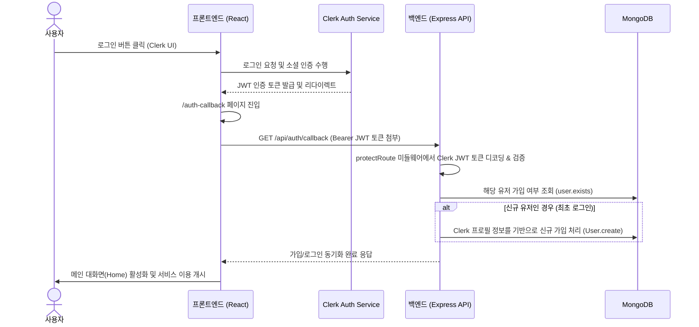

# 🔐 Clerk 인증(Authentication) 도입 및 풀스택 연동 가이드

본 문서는 프로젝트에서 **Clerk** 서비스를 활용하여 풀스택 인증 시스템을 구축하고, 백엔드 데이터베이스(MongoDB)와 동기화하기 위한 전체 과정과 연동 절차를 단계별로 상세히 안내합니다.

---

## 📌 전체 흐름 시퀀스 다이어그램



---

## 1단계. Clerk 공식 사이트(Clerk Site) 설정

풀스택 연동의 출발점으로 Clerk 대시보드에서 애플리케이션을 생성하고 API Key를 발급받아야 합니다.

1. **Clerk 가입 및 대시보드 진입**:
   - [Clerk 공식 홈페이지(https://clerk.com)](https://clerk.com)에 가입한 뒤 Dashboard로 이동합니다.
2. **신규 프로젝트(Application) 생성**:
   - `Create application` 버튼을 클릭합니다.
   - 애플리케이션 이름(예: `Spotify-Clone`)을 입력합니다.
   - 활성화할 인증 수단을 선택합니다:
     - **Email address** 및 **Google** 소셜 로그인을 체크해 줍니다.
   - `Create Application`을 클릭해 생성을 완료합니다.
3. **API Key 확인 및 복사**:
   - 대시보드의 **API Keys** 메뉴로 이동합니다.
   - 다음 두 가지 키를 따로 메모해 둡니다:
     - **Publishable Key**: 프론트엔드(React)에서 사용할 공개 키. (형식: `pk_test_...`)
     - **Secret Key**: 백엔드(Express)에서 사용할 비밀 키. (형식: `sk_test_...`)
4. **리다이렉트 및 SSO 콜백 설정 (개발 환경용)**:
   - **Paths** 설정 메뉴에서 사용자가 로그인을 완료한 후 돌아올 경로를 지정합니다.
   - 본 프로젝트의 라우터 구조상 아래와 같이 매핑합니다:
     - Sign-in path: `/`
     - Sign-up path: `/`
     - SSO Callback/Redirect URL: `http://localhost:5173/sso-callback` (또는 프론트엔드 개발 서버 주소)

---

## 2단계. 프론트엔드(Frontend) 설정 및 구현

클라이언트 사이드에서 Clerk SDK를 주입하고, 로그인 상태에 따라 UI를 분기하며 토큰을 백엔드로 전달하는 흐름을 잡습니다.

### 1) 의존성 설치
프론트엔드 폴더(`frontend/`) 경로에서 React용 Clerk SDK를 설치합니다.
```bash
cd frontend
npm install @clerk/react
```

### 2) 환경 변수 등록
`frontend/.env.local` 파일을 생성(또는 수정)하고 Clerk 대시보드에서 가져온 Publishable Key를 입력합니다.
```env
VITE_CLERK_PUBLISHABLE_KEY=pk_test_...
```
*(Vite 앱에서는 접두사 `VITE_`가 붙은 변수만 클라이언트 코드에서 인식 가능합니다)*

### 3) 최상위 프로바이더 설정 (`main.tsx` 또는 `App.tsx` 부근)
React 앱 전체에 로그인 세션 상태를 공급하기 위해 `ClerkProvider`로 엔트리포인트를 랩핑해야 합니다.
본 프로젝트에서는 `AuthProvider.tsx` 공급자를 사용하여 Clerk를 연동하고 있습니다.
```typescript
import { ClerkProvider } from "@clerk/react";

const clerkPublishableKey = import.meta.env.VITE_CLERK_PUBLISHABLE_KEY;

if (!clerkPublishableKey) {
  throw new Error("Missing Publishable Key");
}

export const AuthProvider = ({ children }: { children: React.ReactNode }) => {
  return (
    <ClerkProvider publishableKey={clerkPublishableKey}>
      {children}
    </ClerkProvider>
  );
};
```

### 4) 로그인 분기 컴포넌트 활용
Clerk가 제공하는 빌트인 컴포넌트를 사용해 로그인한 유저에게만 특정 메뉴나 페이지를 보여줍니다.
- `<SignedIn>`: 로그인 상태인 유저에게만 자식 요소를 노출합니다.
- `<SignedOut>`: 로그아웃 상태인 유저에게만 자식 요소를 노출합니다.
- `<UserButton>`: Clerk가 제공하는 프로필 이미지 아바타로, 클릭 시 로그아웃 및 계정 관리 팝업이 내장되어 있습니다.

### 5) 백엔드 요청을 위한 JWT 토큰 가로채기 (Axios Interceptor)
로그인한 유저는 모든 백엔드 API를 요청할 때 **Clerk이 인증한 JWT 토큰(Bearer Token)**을 헤더에 실어 보내야 합니다.
`frontend/src/lib/axios.ts`에서 다음과 같이 구성합니다:
```typescript
import axios from "axios";

export const axiosInstance = axios.create({
  baseURL: import.meta.env.DEV ? "http://localhost:3000/api" : "/api",
});

// 모든 요청 직전에 Clerk 세션 토큰을 획득해 Authorization 헤더에 Bearer 토큰으로 삽입
export const setAxiosToken = (token: string | null) => {
  if (token) {
    axiosInstance.defaults.headers.common["Authorization"] = `Bearer ${token}`;
  } else {
    delete axiosInstance.defaults.headers.common["Authorization"];
  }
};
```

### 6) 최초 로그인 시 백엔드 DB 가입 동기화 (`/auth-callback`)
로그인이 완료되면 프론트엔드는 `/auth-callback` 페이지로 리다이렉트되어 즉시 백엔드의 동기화 API를 호출합니다:
```typescript
// AuthCallbackPage.tsx 내부 동작 예시
const { getToken } = useAuth();

useEffect(() => {
  const syncUser = async () => {
    try {
      const token = await getToken();
      setAxiosToken(token); // 토큰 헤더 적용
      
      // 백엔드에 회원 가입 동기화 요청
      await axiosInstance.get("/auth/callback"); 
      navigate("/"); // 동기화 완료 시 홈으로 이동
    } catch (error) {
      console.error("User sync failed", error);
    }
  };
  syncUser();
}, [getToken, navigate]);
```

---

## 3단계. 백엔드(Backend) 설정 및 구현

클라이언트가 전달한 JWT Bearer 토큰의 서명을 검증하고, 인증 정보를 파싱하여 내부 데이터베이스(MongoDB)와 동기화 및 회원 검증을 수행합니다.

### 1) 의존성 설치
백엔드 폴더(`backend/`) 경로에서 Express 및 Node용 Clerk SDK 미들웨어를 설치합니다.
```bash
cd backend
npm install @clerk/express
```

### 2) 환경 변수 등록
`backend/.env` 파일에 Clerk에서 복사한 퍼블리셔블 키와 시크릿 키를 정의해 둡니다.
```env
CLERK_PUBLISHABLE_KEY=pk_test_...
CLERK_SECRET_KEY=sk_test_...
```
*(Secret Key는 절대 클라이언트에 유출되어서는 안 되며 백엔드 메모리 내에서만 사용됩니다)*

### 3) Clerk Express 미들웨어 로드 및 서버 시작
`backend/src/server.js`에 전역 Clerk 미들웨어를 탑재하여, 라우트에 진입하기 전 모든 Request 객체에 Clerk 세션 컨텍스트가 자동으로 부착되도록 만듭니다.
```javascript
import { clerkMiddleware } from '@clerk/express';
import express from 'express';

const app = express();

app.use(clerkMiddleware()); // Express Request 객체에 req.auth 세션 컨텍스트 주입
```

### 4) 공통 인증 검증 및 MongoDB 동기화 미들웨어 구현 (`protectRoute`)
백엔드 핵심 파일인 `backend/src/middleware/auth.middleware.js`에서 클라이언트가 전달한 토큰을 기반으로 MongoDB와의 연계를 완수합니다.
```javascript
import { clerkClient } from '@clerk/express';
import { User } from '../models/user.model.js';

export const protectRoute = async (req, res, next) => {
  try {
    // 1. clerkMiddleware가 가로챈 auth 세션에서 clerkUserId를 확인합니다.
    const clerkUserId = req.auth.userId;
    
    if (!clerkUserId) {
      return res.status(401).json({ message: "로그인이 필요한 서비스입니다. (Unauthorized)" });
    }

    // 2. MongoDB 데이터베이스에 해당 유저가 가입되어 있는지 조회합니다.
    let user = await User.findOne({ clerkId: clerkUserId });

    // 3. 만약 최초 로그인하여 DB에 정보가 없다면, Clerk API 서버에서 직접 프로필 상세를 내려받아 DB에 생성(동기화)합니다.
    if (!user) {
      // Clerk Client를 통해 해당 사용자 객체 조회
      const clerkUser = await clerkClient.users.getUser(clerkUserId);
      
      const email = clerkUser.emailAddresses[0]?.emailAddress;
      const fullName = `${clerkUser.firstName || ""} ${clerkUser.lastName || ""}`.trim() || "User";
      const imageUrl = clerkUser.imageUrl;

      user = await User.create({
        clerkId: clerkUserId,
        fullName,
        imageUrl,
        email
      });
      console.log(`[Sync] 신규 유저 생성 완료: ${fullName}`);
    }

    // 4. 조회되거나 새로 가입된 Mongoose User 객체를 req.currentUser에 할당하여 다음 컨트롤러가 활용할 수 있게 합니다.
    req.currentUser = user;
    next();
  } catch (error) {
    console.error("인증 처리 중 에러 발생:", error);
    res.status(500).json({ message: "서버 인증 과정에서 오류가 발생했습니다." });
  }
};
```

### 5) 동기화 콜백 API 엔드포인트 바인딩 (`auth.controller.js`)
최초 가입 처리 또는 로그인 정보 갱신을 위해 프론트엔드가 보낸 `/auth/callback` 요청을 수신하는 컨트롤러입니다. 이미 `protectRoute` 미들웨어에서 모든 동기화 로직을 보장하므로 컨트롤러는 응답 코드만 리턴해 줍니다:
```javascript
// auth.controller.js
export const authCallback = async (req, res, next) => {
  try {
    // protectRoute가 이미 req.currentUser를 안전하게 검증/생성하여 꽂아준 상태입니다.
    res.status(200).json({ success: true, user: req.currentUser });
  } catch (error) {
    next(error);
  }
};
```

---

## 4단계. 최종 점검 사항 (Troubleshooting)

1. **토큰 만료 혹은 헤더 누락**: 
   - 프론트엔드에서 API 통신 직전에 반드시 `await getToken()`으로 발급받은 최신 유효 토큰을 `Authorization` Bearer 헤더에 갱신 주입했는지 점검하십시오.
2. **어드민 권한 통제**:
   - 특정 유저에게 어드민 권한을 주고 싶다면, `backend/.env` 파일의 `ADMIN_EMAIL`에 해당 유저의 Clerk 가입 이메일 주소를 입력하면 `AuthProvider`와 백엔드 미들웨어에서 관리자 전용 대시보드가 활성화됩니다.
3. **CORS 허용**:
   - 로컬 개발 환경 통신 시, 백엔드 서버에 프론트엔드 출처(기본 `http://localhost:5173`)가 CORS 허용 리스트에 명시되어 있어야 인증 토큰 헤더가 거부되지 않습니다.
